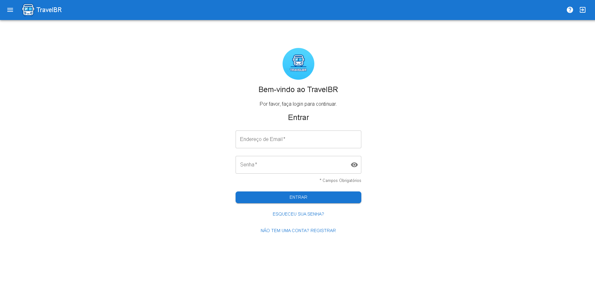
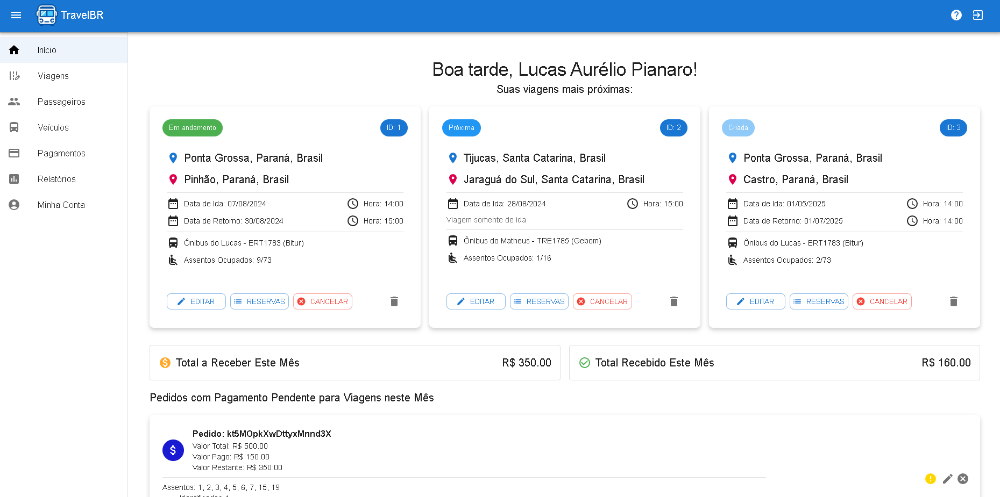
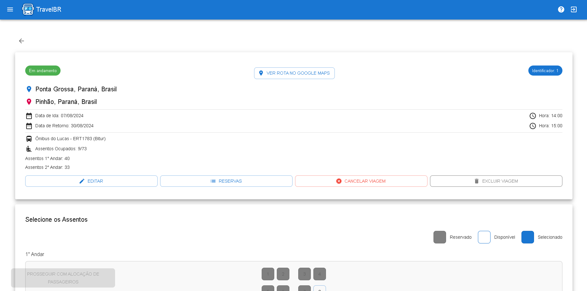
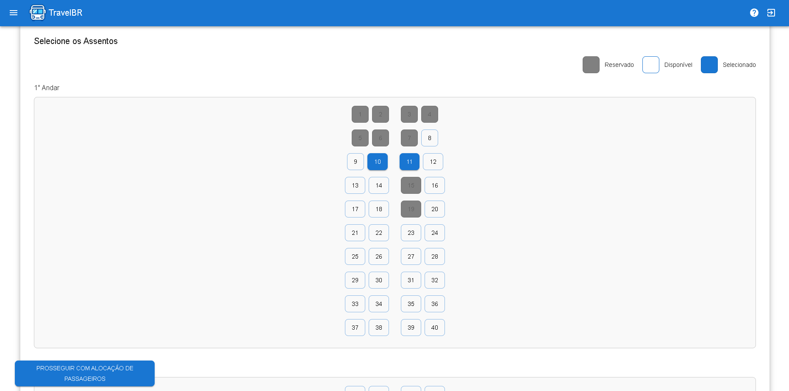
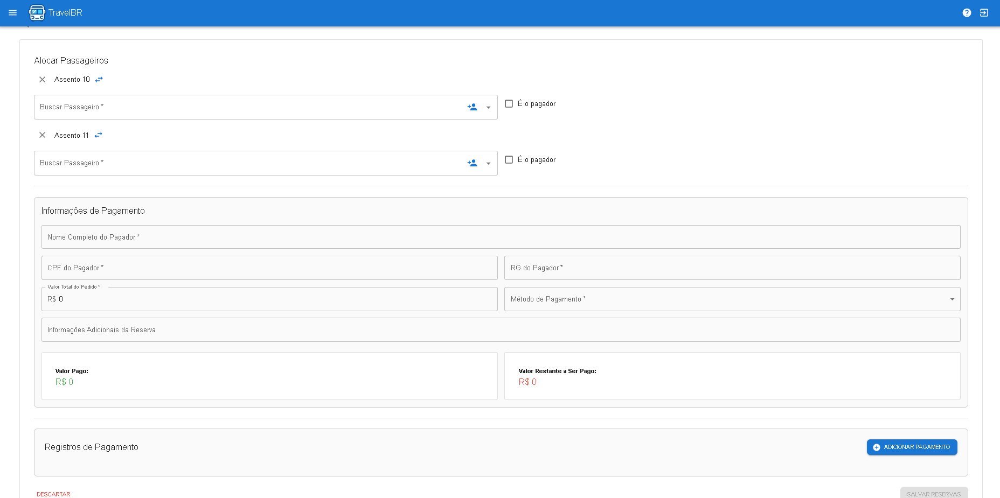
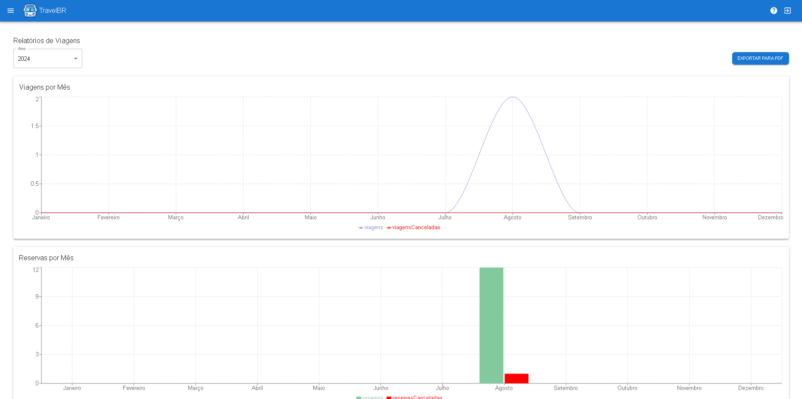

# TravelBR

## Descrição

O TravelBR é uma aplicação web desenvolvida para gerenciar viagens, pedidos e reservas. Utiliza Firebase para autenticação e armazenamento de dados. A aplicação permite que usuários autenticados adicionem, atualizem e visualizem viagens, além de gerenciar pedidos e reservas associadas a essas viagens. Também inclui funcionalidades para gerar relatórios e exportá-los em formato PDF.

## Funcionalidades

- **Gerenciamento de Viagens**: Adicionar, atualizar e visualizar viagens.
- **Gerenciamento de Pedidos**: Adicionar e atualizar pedidos associados a viagens.
- **Gerenciamento de Reservas**: Adicionar, atualizar e cancelar reservas.
- **Gerenciamento de Passageiros**: Adicionar, atualizar e excluir informações de passageiros.
- **Gerenciamento de Veículos**: Adicionar, atualizar e excluir informações de veículos.
- **Relatórios**: Geração de relatórios de viagens, incluindo a quantidade de reservas por destino.
- **Exportação para PDF**: Exportação dos relatórios gerados em formato PDF.
- **Seleção de Localização**: Sugestões de localização utilizando a API Nominatim.

## Tecnologias Utilizadas

- **React**: Biblioteca JavaScript para construção de interfaces de usuário.
- **Firebase**: Plataforma de desenvolvimento de aplicativos móveis e web.
  - **Firestore**: Banco de dados NoSQL em tempo real.
  - **Auth**: Serviço de autenticação.
- **Recharts**: Biblioteca para criação de gráficos em React.
- **Material-UI**: Biblioteca de componentes de interface de usuário.
- **jsPDF**: Biblioteca para geração de documentos PDF.
- **autoTable**: Plugin para jsPDF para criação de tabelas.
- **Nominatim**: API externa para sugestões de localização baseadas em OpenStreetMap.

## Estrutura do Projeto

- **src/**
  - **common/**: Componentes comuns reutilizáveis.
  - **components/**: Componentes principais da aplicação.
  - **services/**: Serviços para comunicação com o Firebase.
  - **contexts/**: Componentes para manipulação de contextos do sistema.
  - **pages/**: Componentes comuns de páginas do sistema.
  - **utils/**: Servicos e componentes para utilização genérica.
  - **firebaseConfig.js**: Configurações do Firebase.

## ScreenShots







## Pré-requisitos

- Node.js v20.12.2
- npm(v10.7.0) ou yarn 
- Conta no Firebase com Firestore e Auth configurados

## Instalação

1. Clone o repositório:
   ```bash
   git clone https://github.com/lucaspianaro/travelbr.git
   ```

2. Navegue até o diretório do projeto:
   ```bash
   cd travelbr 
   ```

3. Instale as dependências:
   ```bash
   npm install
   ```

4. Instale os pacotes npm necessários:
   ```bash
   npm install @mui/material @emotion/react @emotion/styled
   npm install firebase
   npm install recharts
   npm install jspdf jspdf-autotable
   npm install jspdf html2canvas
   npm install react-idle-timer
   npm install date-fns
   ```

5. Configure o Firebase:
   - Crie um arquivo `firebaseConfig.js` na pasta `src` com as suas configurações do Firebase, você consegue encontrá-las após configurar um projeto no Firebase:
     ```javascript
     import { initializeApp } from 'firebase/app';
     import { getFirestore } from 'firebase/firestore';
     import { getAuth } from 'firebase/auth';

     const firebaseConfig = {
       apiKey: "YOUR_API_KEY",
       authDomain: "YOUR_AUTH_DOMAIN",
       projectId: "YOUR_PROJECT_ID",
       storageBucket: "YOUR_STORAGE_BUCKET",
       messagingSenderId: "YOUR_MESSAGING_SENDER_ID",
       appId: "YOUR_APP_ID"
     };

     const app = initializeApp(firebaseConfig);
     const db = getFirestore(app);
     const auth = getAuth(app);

     export { db, auth };
     ```

## Uso

1. Inicie a aplicação:
   ```bash
   npm start
   ```

2. Acesse a aplicação no navegador:
   ```
   http://localhost:3000
   ```

3. Autentique-se com um usuário do Firebase para acessar as funcionalidades da aplicação.

## Deploy

Para fazer o deploy da aplicação no Firebase Hosting, siga as etapas abaixo:

1. Compile a aplicação:
   ```bash
   npm run build
   ```

2. Faça o deploy no Firebase Hosting:
   ```bash
   firebase deploy --only hosting
   ```

## Contribuição

Contribuições são bem-vindas! Sinta-se à vontade para abrir issues e pull requests.
